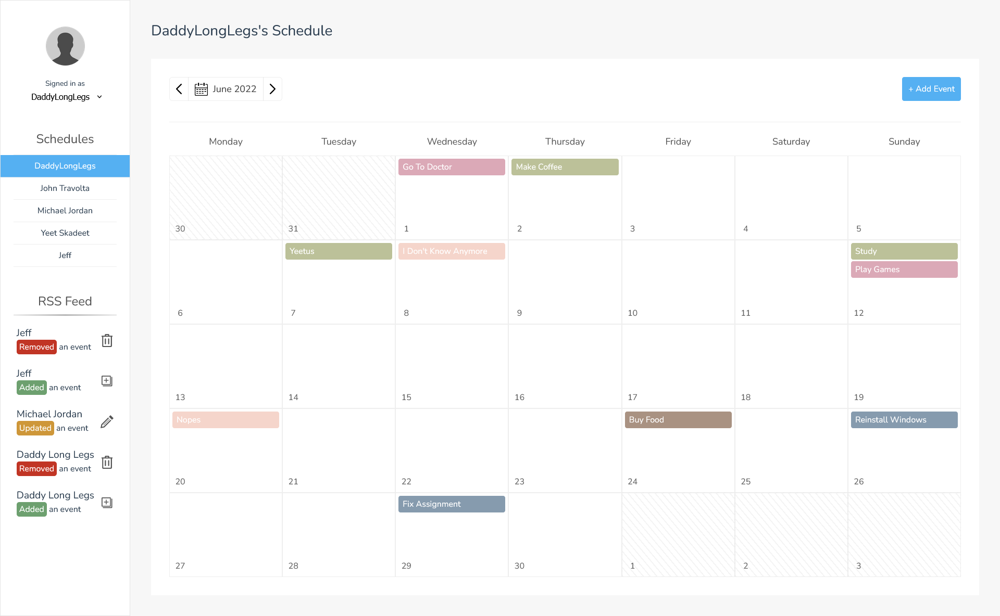
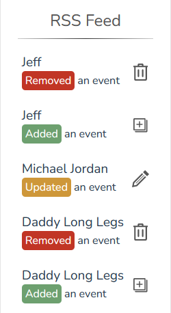

[comment]: # (Open this link to view README Better https://github.com/francois-smith/Scheduling-Application)

<div id="top"></div>

<br />
<div align="center">
  <h1 align="center">IMY 210 | Project</h1>
  <p align="center">
    <div align="center">
        
    </div>
    <h3>Scheduling Application</h3>
    <br />
    <div style="margin-top: -25px">
        <a href="https://github.com/francois-smith/IMY-210/issues">Report Bug</a>
        ·
        <a href="https://github.com/francois-smith/IMY-210/issues">Request Feature</a>
    </div>
  </p>
</div>

<br />

## About The Project

This Project is built using Vue.js as front end with a RESTful server supporting the backend. 

Data is stored using XML and is validated using a global XML Schema file. The restful server allows the usage of basic CRUD commands.

<br/>

## Usage

Extract the dowloaded .zip file to the loaction of your choice. Make sure you have Nodejs intalled on your machine to be able to run `npm` commands.

Once the files are extracted, open the RESTful folder using CMD or your code editor of choices' terminal.

Run the following commands to activate your server:

- Installing dependencies
```
  npm install
```
- Running the server (server will default to port: 3000)
```
  node server.js
```

Once your server is up and running navigate one folder back and locate the VUE folder, open this folder in CMD or integrated terminal. Run the following commands to start up the client:

- Installing dependencies
```
  npm install
```
- Start the development session. (server will default to port: 8080)
```
  npm run serve
```

This will start a client on port: 8080, you can open your browser of choice and enter localhost:8080 (or use the link displayed in terminal). This will open up the web client and you can now use the scheduling application.

<br/>

# Features
<br/>

<div align="center">
    <h2 style="margin-bottom: -10px">Phase 1</h2>
</div>

### File Validation
- All XML files containing schedules are validated with a universal .xsd file, this file is robust to keep a unified structure for all schedules and events.
 
### Displaying Information
- Each `schedule`.xml can be opened in a browser to see a structured view of the contents, all schedules are linked to a .xsl file to format the data into a readable format. The xslt is data agnostic so it will work with any schedule.

<div align="center">
    <h2 style="margin-bottom: -10px">Phase 2</h2>
</div>

### RESTful Server
- The server provides the ability to perform CRUD events on the XML files. These commands are hidden from the user, but rather get called from the visual client.
- The server includes GET, POST, DELETE and PUT commands, examples of requests made with these commands are listed below.
     
- GET
    - There are 2 versions of GET.
    - The fist type is to request an entire schedule object of a specific user. An example body looks as follows:
        ```
            {
                "userName": "ExampleUser" //required
            }
        ```
        This will fetch the file associated with the specified user, it also returns error message if user does not exist or file could not be found.   
    - The second type searches for an event with a specific ID within a user's schedule file. An example body looks as follows: 
        ```
            {
                "userName": "ExampleUser", //required
                "eventId": "EVT123456" //required
            }
        ```
        This will fetch the file associated with the specified user and search through all events saved in this file for the eventID, if the ID does not exist within the file then a relevant error is returned. It also returns an error message if user does not exist or file could not be found.  

- POST
    - There is a single POST command.
    - The POST request lightly asumes that the data that is sent from the client side is correct. The server still does a lot of error checking to adhere to the XML Schema and if a certain field does not adhere to the rules then a relevant error is returned.
    - POST takes in a user and event, the user is used to determine what schedule to add the event to. The event is a structured JSON object that is compiled on the client side when request is made.
    - An example request looks as follows:
        ```
            {
                "userName": "ExampleUser", //required
                "event": { 
                    "id": "EVT123456", //required
                    "title": "Example", //required
                    "type": "Task", //required
                    "date": {
                        "repeat": "Daily", //optional
                        "day": 4, //required
                        "month": "January", //required
                        "startingTime": "03:30 PM", //optional
                        "endingTime": "04:30 PM" //optional
                    },
                    "guests":[ //required
                        {
                            "guest":[ //optional, max 10 entries
                                { //each guest must contain at least a name or title
                                    "name": ["name"], //optional
                                    "email": ["email"] //optional
                                },
                                {
                                    "name": ["name"], //optional
                                    "email": ["email"] //optional
                                }
                            ]
                        }
                    ],
                    "venue": "Example", //optional
                    "description": "Example" //optional
                } 
            }
        ```
- PUT
    - There is a single PUT command.
    - PUT takes in a user and update event, the user is used to determine what schedule to update the event in. The updated event is validated on server side. Relevant errors are returned if the info is incorrect.
    - An example request looks as follows:
        ```
            {
                "userName": "ExampleUser", //required
                "updatedEvent": { 
                    "id": "EVT123456", //required
                    "title": "Example", //required
                    "type": "Task", //required
                    "date": {
                        "repeat": "Daily", //optional
                        "day": 4, //required
                        "month": "January", //required
                        "startingTime": "03:30 PM", //optional
                        "endingTime": "04:30 PM" //optional
                    },
                    "guests":[ //required
                        {
                            "guest":[ //optional, max 10 entries
                                { //each guest must contain at least a name or title
                                    "name": ["name"], //optional
                                    "email": ["email"] //optional
                                },
                                {
                                    "name": ["name"], //optional
                                    "email": ["email"] //optional
                                }
                            ]
                        }
                    ],
                    "venue": "Example", //optional
                    "description": "Example" //optional
                } 
            }
        ```

- DELETE
    - There is a single DELETE command. This will load the file associated with the inputed user, if no event is found with the passed in ID then an error is returned.  
        ```
            {
                "userName": "ExampleUser", //required
                "eventId": "EVT123456" //required
            }
        ```
        It will return the new JSON object of the schedule after delete to allow the calendar on the client side to be updated.

<div align="center">
    <h2 style="margin-bottom: -10px">Phase 3</h2>
</div>


### Application
- The frontend is built using Vue.js, data is recieved from server then populated accordingly.
- There are 5 users built into the system without the ability to add new users. For demo purposes you can log in as any user and also view any calendar (updates cannot be made to other user calendars, more info below).
- Some features:
    - User schedules can be selected from a list of calendars (no calendar is selcted by default), if current user is the owner of the selected calendar then all CRUD functionality is available manipulate the data.
    - If a user opens a schedule that is not owned by them they can still view the data but they cannot perform CRUD events.
    - Using the built in dropdown a the active user can be selected, imitating an account system with different users.

### Interacting With The Data
- Using the client ui, functions are bult into buttons to communicate with the RESTful server to perform CRUD functions on events and schedules.

<div align="center">
    <h2 style="margin-bottom: -10px">Extras</h2>
</div>


### RSS Feed
- The client side includes a section built into the side bar that showcases updates based on all user ativity. As soon as a user deletes, updated or adds an event to thier shedule the RSS feed showcases this with the exact action that took place [Example Below].

<div align="center">
    
</div>

### Validation on Server
- If POST or PUT gets called on server, thorough checks are done on all aspects of the sent event to make sure it follows the schema rules before it gets added to the correct XML file.

<br/>

<!-- LICENSE -->
## License

Distributed under the MIT License. See `LICENSE.txt` for more information.

<br/>

<p align="right">(<a href="#top">back to top</a>)</p>

